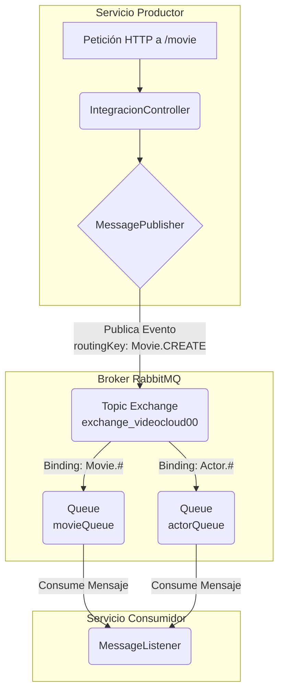
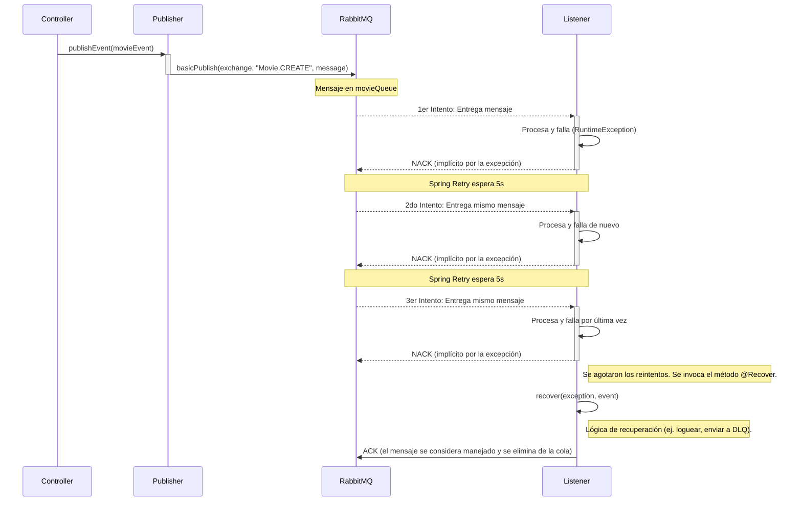

# \#\# Sistema de Eventos Asíncronos con RabbitMQ y Spring AMQP

Este proyecto implementa un sistema de comunicación asíncrona basado en eventos utilizando **Spring Boot** y **RabbitMQ**. La arquitectura está diseñada para desacoplar los servicios, permitiendo que eventos de dominio (como la creación de `Movie` o `Actor`) se publiquen y se consuman de forma robusta y resiliente.

Una característica clave de esta implementación es su capacidad para manejar errores de procesamiento mediante un **patrón de reintentos y recuperación**, asegurando que los mensajes no se pierdan ante fallos temporales.

-----

## \#\# Arquitectura de Mensajería

El sistema utiliza un **Topic Exchange** como núcleo de su enrutamiento de mensajes. Este tipo de exchange ofrece una gran flexibilidad para dirigir los eventos a las colas correctas basándose en una `routing key`.

### \#\#\# Componentes Principales

* **Publisher (`MessagePublisher`)**: Servicio responsable de enviar los eventos al exchange de RabbitMQ. Se invoca desde el `IntegracionController` cada vez que se recibe una petición HTTP para crear una nueva entidad.
* **Exchange (`exchange_videocloud00`)**: Un **Topic Exchange** que recibe todos los eventos de dominio. Actúa como un distribuidor inteligente que examina la `routing key` de cada mensaje para decidir a qué cola(s) debe enviarlo.
* **Routing Key**: Una etiqueta que describe el evento (ej. `Movie.CREATE`). Es generada dinámicamente por la clase `Event` y utilizada por el exchange para el enrutamiento.
* **Queues (Colas)**: Almacenes de mensajes. En este proyecto, las colas (`movieQueue`, `actorQueue`) son declaradas implícitamente por el consumidor gracias a las anotaciones de Spring AMQP, lo que simplifica la configuración.
* **Consumer (`MessageListener`)**: Es el servicio que escucha en una o más colas. Contiene la lógica para procesar los eventos recibidos y está equipado con mecanismos de manejo de errores.

### \#\#\# Diagrama de la Arquitectura

Este diagrama visualiza cómo los componentes interactúan entre sí.



-----

## \#\# Flujo de un Evento y Manejo de Errores

El verdadero potencial de esta arquitectura se revela en cómo maneja tanto el flujo exitoso como los escenarios de error.

1.  **Publicación del Evento**:

    * Una petición llega al endpoint `/movie` del `IntegracionController`.
    * Se crea un `Event` de tipo `CREATE` que envuelve al objeto `Movie`. La `routing key` `Movie.CREATE` se genera automáticamente.
    * El `MessagePublisher` envía el evento serializado al exchange `exchange_videocloud00`.

2.  **Enrutamiento y Cola**:

    * El exchange recibe el mensaje y, basándose en la `routing key`, lo enruta a la `movieQueue` porque su binding (`Movie.#`) coincide.

3.  **Consumo y Procesamiento**:

    * El método `handleMovieEvent` en `MessageListener` recibe el mensaje de la `movieQueue`.
    * Intenta procesar el evento. En el código actual, **se fuerza un `RuntimeException` para simular un fallo**.

### \#\#\# 🛡️ Patrón de Resiliencia: Reintentos y Recuperación

Aquí es donde la implementación brilla. Gracias a **Spring Retry** (`@EnableRetry`), el sistema no descarta el mensaje al primer error.

* **Reintentos (`@Retryable`)**:

    * Al detectar la `RuntimeException`, Spring intercepta el error.
    * El framework espera un tiempo determinado (`backoff = @Backoff(delay = 5000)`, es decir, 5 segundos) y vuelve a invocar el método `handleMovieEvent` con el mismo mensaje.
    * Este proceso se repite hasta un máximo de 3 intentos (`maxAttempts = 3`).

* **Recuperación (`@Recover`)**:

    * Si los 3 intentos fallan, Spring Retry abandona y busca un método de recuperación.
    * Se invoca al método `recover`, pasándole la excepción final y el evento original que causó el problema.
    * Este método actúa como el último recurso. Aquí se puede implementar una lógica para **enviar el mensaje a una Dead Letter Queue (DLQ)**, registrar el error en un sistema de monitoreo o guardarlo en una base de datos para análisis manual.

### \#\#\# Diagrama de Secuencia con Fallo y Reintentos

Este diagrama ilustra el flujo completo cuando ocurre un error de procesamiento.



-----

## \#\# Configuración

Toda la configuración de RabbitMQ se gestiona centralmente en `src/main/resources/application.properties`.

```properties
# Conexión al servidor RabbitMQ
spring.rabbitmq.password=taller.2024
spring.rabbitmq.username=taller
spring.rabbitmq.host=localhost
spring.rabbitmq.port=30567

# Exchange para eventos de dominio (Movie, Actor)
rabbitmq.event.exchange.name=exchange_videocloud00

# Configuración para la cola y routing de Películas
rabbitmq.event.movie.queue.name=movieQueue
rabbitmq.event.movie.routing.key=Movie.#

# Configuración para la cola y routing de Actores
rabbitmq.event.actor.queue.name=actorQueue
rabbitmq.event.actor.routing.key=Actor.#
```

-----

## \#\# Cómo Ejecutar y Probar

1.  **Requisitos**:

    * Tener una instancia de RabbitMQ corriendo y accesible.
    * Java 21 y Maven instalados.

2.  **Iniciar la Aplicación**:

    ```bash
    mvn spring-boot:run
    ```

3.  **Probar el Flujo y los Reintentos**:

    * Realiza una petición `GET` a `http://localhost:8088/movie`.
    * Observa la consola de la aplicación. Verás los logs del `MessagePublisher` enviando el evento.
    * Inmediatamente después, verás que el `MessageListener` intenta procesar el mensaje y falla.
    * Gracias a la configuración de reintentos, verás que el intento de procesamiento se repite dos veces más, con una pausa de 5 segundos entre cada uno.
    * Tras el último fallo, verás el log del método `recover`, indicando que el mensaje ha entrado en el flujo de recuperación.
    * Finalmente, puedes verificar en la interfaz de RabbitMQ que la cola `movieQueue` está vacía, ya que el mensaje se consideró manejado (ACK) después del proceso de recuperación.