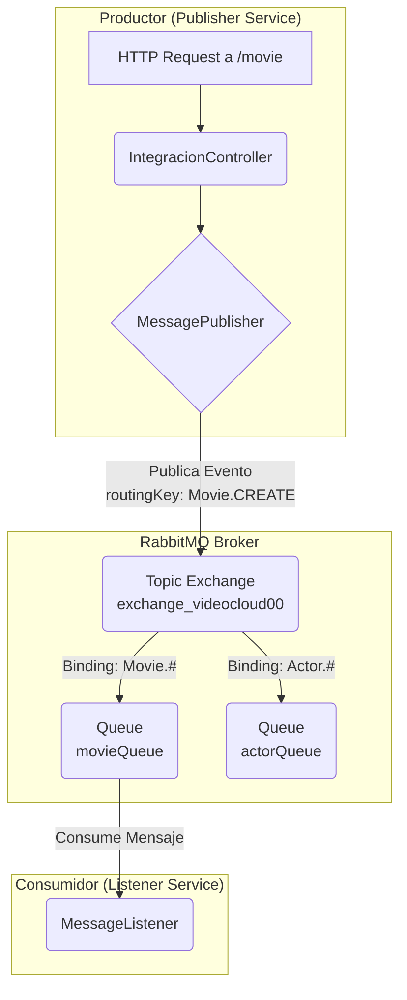
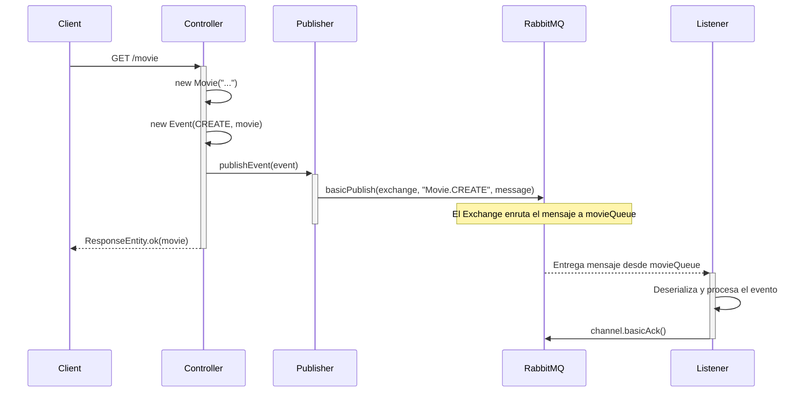

# AMQP RabbitMQ Event Publisher/Listener

Este proyecto es un ejemplo de una aplicación basada en Spring Boot que demuestra un patrón de publicación y suscripción de eventos utilizando **RabbitMQ** como message broker.

El sistema permite publicar eventos cuando se crean nuevas entidades (como `Movie` o `Actor`) y consumirlos de forma asíncrona para su procesamiento. Esto desacopla los componentes del sistema, mejorando la escalabilidad y la resiliencia.

## \#\# Arquitectura de Mensajería con RabbitMQ

La comunicación se basa en un **Topic Exchange**, uno de los tipos de exchanges más flexibles de RabbitMQ. Permite un enrutamiento de mensajes muy granular basado en patrones de *routing keys*.

### \#\#\# Conceptos Clave

* **Publisher:** Es el componente que origina y envía el mensaje. En este proyecto, es la clase `MessagePublisher`, que se invoca desde el `IntegracionController` cuando llega una petición HTTP.
* **Exchange:** Recibe los mensajes del publisher y los enruta a una o más colas. Utilizamos un **Topic Exchange** llamado `exchange_videocloud00`. Su trabajo es como el de un cartero inteligente que mira la dirección (la routing key) y decide a qué buzones (colas) debe entregar la carta.
* **Routing Key:** Es una "etiqueta" que el publisher le pone al mensaje (ej: `Movie.CREATE`). El exchange la usa para decidir el enrutamiento. En nuestro caso, se genera dinámicamente en la clase `Event`.
* **Queue (Cola):** Es el buzón donde se almacenan los mensajes hasta que un consumidor esté listo para procesarlos. Tenemos definidas las colas `movieQueue` y `actorQueue`.
* **Binding:** Es la regla que conecta un exchange con una cola. Se define con un *binding key* (un patrón). Por ejemplo, la cola `movieQueue` está conectada al exchange con el patrón `Movie.#`. Esto significa: "envía a esta cola todos los mensajes cuya routing key empiece con `Movie.`".
* **Consumer/Listener:** Es el componente que se suscribe a una cola, recibe los mensajes y los procesa. En este proyecto, es la clase `MessageListener`.

-----

### \#\#\# Diagrama de la Arquitectura

El siguiente diagrama ilustra cómo interactúan los componentes principales:



-----

## \#\# Flujo de un Evento `Movie`

Para entender el proceso completo, sigamos el camino de un mensaje desde su creación hasta su consumo.

1.  **Inicio:** Un cliente realiza una petición `GET` al endpoint `/movie`.
2.  **Publicación:**
    * El `IntegracionController` recibe la petición.
    * Crea un objeto `Movie`.
    * Envuelve el objeto `Movie` en un objeto `Event`, especificando el tipo `CREATE`.
    * El objeto `Event` genera automáticamente la **routing key** `Movie.CREATE`.
    * Se invoca al `MessagePublisher`, que serializa el objeto `Event` a JSON y lo envía al exchange `exchange_videocloud00` con dicha routing key.
3.  **Enrutamiento (Routing):**
    * El exchange `exchange_videocloud00` recibe el mensaje.
    * Revisa la routing key (`Movie.CREATE`) y busca qué bindings coinciden.
    * Encuentra que el patrón `Movie.#` del binding hacia `movieQueue` coincide.
    * El exchange deposita una copia del mensaje en la cola `movieQueue`.
4.  **Consumo:**
    * El `MessageListener`, que está escuchando permanentemente en `movieQueue`, recibe el mensaje.
    * Deserializa el JSON para reconstruir el objeto `Event<String, Movie>`.
    * Procesa la lógica de negocio (en el código actual, solo lo loguea).
    * Envía una confirmación (**manual ACK**) a RabbitMQ para indicarle que el mensaje fue procesado correctamente y que puede ser eliminado de la cola de forma segura. Si ocurriera un error, enviaría un **NACK** para rechazarlo.

### \#\#\# Diagrama de Secuencia del Flujo



-----

## \#\# Configuración

La conexión y configuración de RabbitMQ se gestiona a través del archivo `src/main/resources/application.properties`.

```properties
# Conexión al servidor RabbitMQ
spring.rabbitmq.password=taller.2024
spring.rabbitmq.username=taller
spring.rabbitmq.host=localhost
spring.rabbitmq.port=30567

# Nombre del Exchange principal para eventos de dominio
rabbitmq.event.exchange.name=exchange_videocloud00

# Configuración para la cola de Películas (Movies)
rabbitmq.event.movie.queue.name=movieQueue
rabbitmq.event.movie.routing.key=Movie.#

# Configuración para la cola de Actores (Actors)
rabbitmq.event.actor.queue.name=actorQueue
rabbitmq.event.actor.routing.key=Actor.#
```

-----

## \#\# Cómo ejecutar y probar

1.  **Requisitos:**

    * Tener una instancia de RabbitMQ corriendo y accesible con los datos de `application.properties`.
    * Tener Java 21 y Maven instalados.

2.  **Levantar la aplicación:**

    ```bash
    mvn spring-boot:run
    ```

3.  **Probar el flujo:**

    * Abre tu navegador o una herramienta como `curl` o Postman.
    * Realiza una petición `GET` a `http://localhost:8088/movie`.
    * Observarás en la consola de la aplicación los logs tanto del mensaje enviado por el `MessagePublisher` como del mensaje recibido por el `MessageListener`.
    * Puedes hacer lo mismo con `http://localhost:8088/actor` para probar el flujo de actores. Aunque no hay un consumidor activo para la cola de actores en el código actual, podrás ver el mensaje en la cola `actorQueue` desde la interfaz de administración de RabbitMQ.