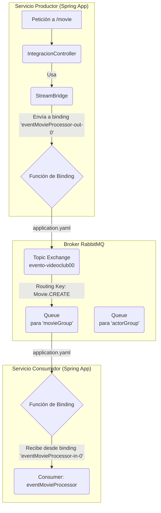
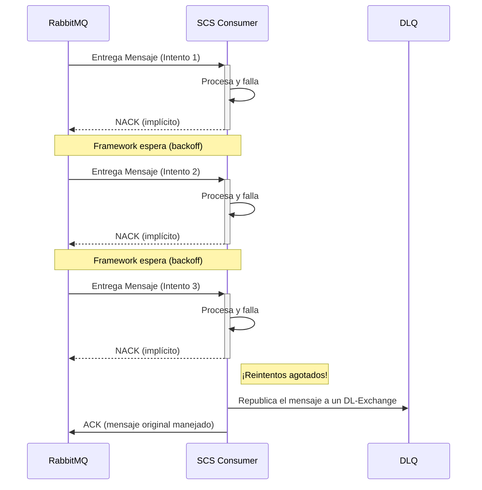

# \#\# Sistema de Eventos con Spring Cloud Stream y RabbitMQ

Este proyecto demuestra una arquitectura de microservicios basada en eventos utilizando **Spring Cloud Stream** con **RabbitMQ** como binder. A diferencia de implementaciones con Spring AMQP, este enfoque se basa en un modelo funcional y una configuración declarativa para desacoplar la lógica de negocio de la infraestructura de mensajería.

El sistema está diseñado para ser altamente resiliente, con capacidades automáticas de **reintentos** y gestión de **Dead Letter Queues (DLQ)** configuradas directamente en el framework.

-----

## \#\# Arquitectura y Conceptos de Spring Cloud Stream

Spring Cloud Stream introduce una capa de abstracción sobre el bróker de mensajería. Los conceptos clave son:

* **Binder**: Es el componente que provee la integración con el sistema de mensajería específico (en este caso, `spring-cloud-stream-binder-rabbit`).
* **Binding**: Es el puente entre el código de la aplicación y el destino físico (el "topic" o "exchange"). Se configuran de manera declarativa en `application.yaml`.
* **Functions (`Consumer`, `Function`, `Supplier`)**: La lógica de negocio se define como beans funcionales. En este proyecto, usamos `Consumer` para procesar los eventos entrantes (`eventMovieProcessor`, `eventActorProcessor`).
* **StreamBridge**: Una utilidad que permite enviar mensajes a un *binding* de salida de forma programática, ideal para casos de uso como controladores REST.
* **Consumer Group**: Un concepto clave para la escalabilidad. Todos los consumidores dentro del mismo grupo comparten la carga de una cola. Spring Cloud Stream crea una cola duradera por cada grupo (`movieGroup`, `actorGroup`).

### \#\#\# Diagrama de la Arquitectura

Este diagrama ilustra cómo Spring Cloud Stream conecta la lógica de la aplicación con RabbitMQ a través de bindings.



*La `Función de Binding` representa la magia de Spring Cloud Stream, que traduce la configuración YAML en la infraestructura real de RabbitMQ.*

-----

## \#\# Flujo de un Evento `Movie`

El flujo de un mensaje es orquestado completamente por la configuración declarativa.

1.  **Inicio (Publicación)**:

    * Una petición `GET` llega al endpoint `/movie` en `IntegracionController`.
    * Se crea un objeto `Event` que encapsula un `Movie` y genera la `routingKey` `Movie.CREATE`.
    * Se utiliza `StreamBridge.send()` para enviar el evento al binding de salida `eventMovieProcessor-out-0`. **El código no conoce el nombre del exchange, solo el nombre del binding**.

2.  **Binding y Enrutamiento**:

    * Spring Cloud Stream consulta el `application.yaml`.
    * Ve que `eventMovieProcessor-out-0` está mapeado al destino (exchange) `evento-videoclub00`.
    * Publica el mensaje en ese exchange, incluyendo la `routingKey` (`Movie.CREATE`) como una cabecera.

3.  **Consumo**:

    * El exchange `evento-videoclub00` enruta el mensaje.
    * El binding de entrada `eventMovieProcessor-in-0` está configurado con el grupo de consumidores `movieGroup`. Spring Cloud Stream automáticamente crea una cola anónima y duradera para este grupo y la enlaza al exchange.
    * El framework entrega el mensaje desde esa cola al bean `Consumer` llamado `eventMovieProcessor`.
    * La función procesa el mensaje.

-----

## \#\# 🛡️ Resiliencia: Reintentos y Dead Letter Queue (DLQ)

Este proyecto delega completamente el manejo de errores al framework, lo que lo hace extremadamente robusto.

* **Reintentos Automáticos**: En `application.yaml`, se configura el comportamiento del consumidor para que, en caso de fallo (una excepción), reintente procesar el mensaje automáticamente.

    * `maxAttempts: 3`: Intentará procesar el mensaje hasta 3 veces.
    * `backOff...`: El tiempo de espera entre reintentos aumentará exponencialmente (500ms, 1000ms).

* **Dead Letter Queue (DLQ)**: Si el mensaje falla todos los reintentos, no se pierde.

    * `autoBindDlq: true`: Le dice a Spring que configure automáticamente una DLQ para este consumidor.
    * `republishToDlq: true`: En lugar del mecanismo por defecto de RabbitMQ, este modo vuelve a publicar el mensaje fallido en un exchange específico para errores (`deadLetterExchange`), lo que permite un enrutamiento más flexible de los mensajes fallidos.
    * El mensaje erróneo termina en la cola `evento-videoclub00.eventMovie.eventGroup.dlq` para su posterior análisis sin detener el flujo principal.

### \#\#\# Diagrama del Flujo de Error



-----

## \#\# Configuración Clave (`application.yaml`)

La lógica de enrutamiento, resiliencia y conexión está centralizada aquí.

```yaml
spring.cloud.function.definition: eventMovieProcessor;eventActorProcessor;keycloakProcessor

spring.cloud.stream:
  bindings:
    # Binding de salida del productor de Movies
    eventMovieProcessor-out-0:
      destination: evento-videoclub00 # Nombre del Exchange
    
    # Binding de entrada para el consumidor de Movies
    eventMovieProcessor-in-0:
      destination: evento-videoclub00 # Nombre del Exchange
      group: movieGroup # Crea una cola duradera para este grupo

# Configuración de reintentos para el consumidor de Movies
spring.cloud.stream.bindings.eventMovieProcessor-in-0.consumer:
  maxAttempts: 3
  backOffInitialInterval: 500

# Configuración de la DLQ específica para RabbitMQ
spring.cloud.stream.rabbit.bindings.eventMovieProcessor-in-0.consumer:
  autoBindDlq: true
  republishToDlq: true
  deadLetterExchange: evento-videoclub00DLX
```

-----

## \#\# Cómo Ejecutar y Probar

1.  **Requisitos**:

    * Tener una instancia de RabbitMQ corriendo y accesible.
    * Java 21 y Maven instalados.

2.  **Iniciar la Aplicación**:

    ```bash
    mvn spring-boot:run
    ```

3.  **Probar el Flujo**:

    * Realiza una petición `GET` a `http://localhost:8088/movie`.
    * Observa la consola de la aplicación. Verás el log del `IntegracionController` enviando el evento.
    * Inmediatamente después, el log del `eventMovieProcessor` mostrará el procesamiento del mensaje.
    * Para probar el flujo de errores, puedes modificar el `eventMovieProcessor` para que lance una `RuntimeException`. Al volver a ejecutar la prueba, observarás los reintentos en la consola y podrás ver el mensaje final en la cola DLQ a través de la interfaz de administración de RabbitMQ.